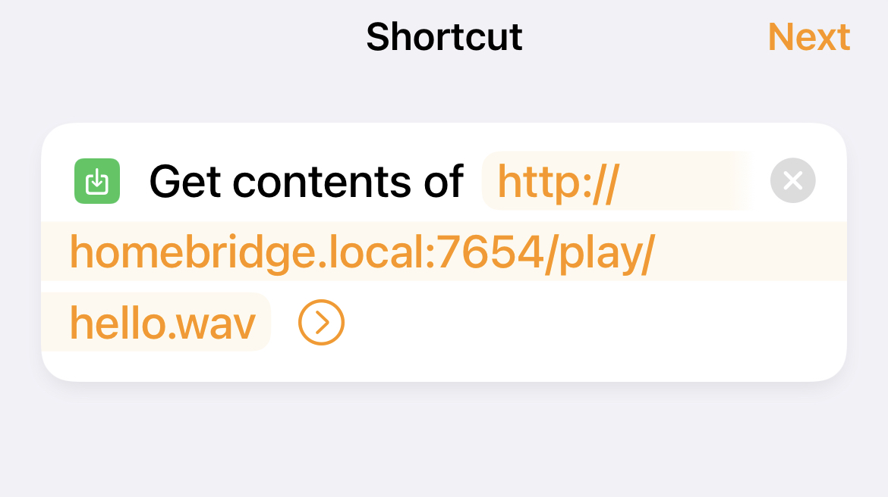
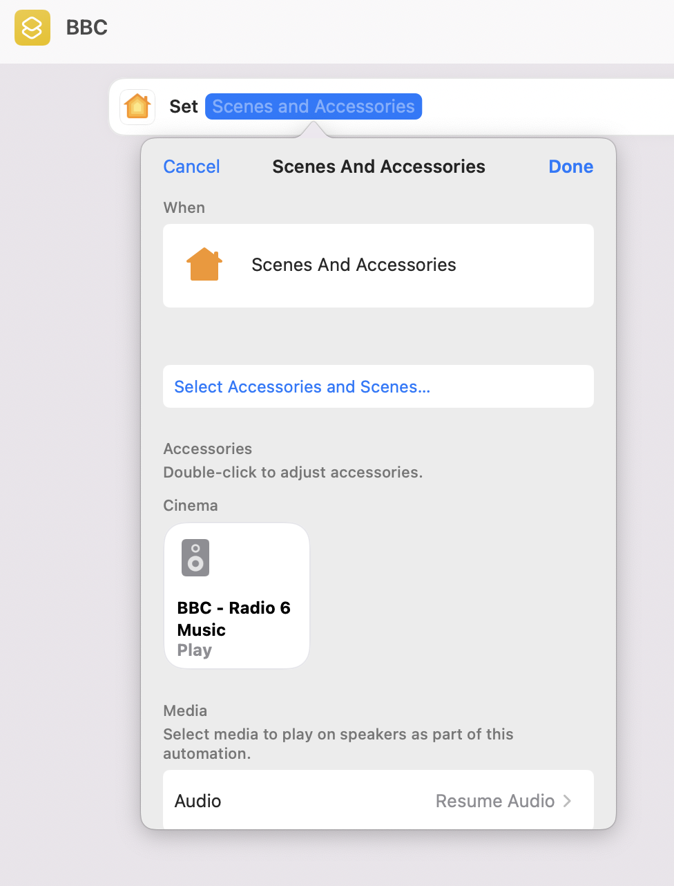

<p align="center">


</p>

# HomePod mini radio support

Homebridge accessory for streaming radio to Homepod mini

## Streaming radio to HomePod (mini)
Main idea is to stream to HomePod mini (or AppleTV) with the following command:
```
ffmpeg -i <streamUrl> -f mp3 - | atvremote --id <homepodId> stream_file=-
```

- automatically stops streaming when homepod is used by another app
- sometimes audio streaming stops, so plugin automatically restarts it 
- "volume" setting (if specified) is used to set volume when streaming starts
- "verboseMode" - by default set to false, for debug set it to true

## Requirements 
- NodeJS (>=8.9.3) with NPM (>=6.4.1)
- ffmpeg
- pyatv

For Homepod device you need to specify the Mac address of the device. 

## Usage Example:

- Multiple radio accessories support (**each radio speaker must be added to home separately with homebridge pin pairing**):

```
{
    "platform": "HomepodRadioPlatform",
    "serialNumber": "20020105:00",
    "homepodId": "<homepod id>",
    "httpPort": 7654,
    "mediaPath": "/media/homepod",
    "radios": [
        {
            "name": "BBC - Radio 1",
            "trackName": "BBC - Radio 1",
            "radioUrl": "http://stream.live.vc.bbcmedia.co.uk/bbc_radio_one",
            "volume": 25,      
            "autoResume": true
        }
    ]
}
```

- Single radio accessory (legacy config):

```
{
    "platforms": [
        {
            "platform": "HomepodRadioPlatform",
            "name": "Homepod Radio",
            "model": "BBC - Radio 1",
            "homepodId": "F422F0103371",
            "radioUrl": "http://stream.live.vc.bbcmedia.co.uk/bbc_radio_one",
            "volume": 25,
            "autoResume": true,
            "httpPort": 7654,
            "mediaPath": "/media/homepod",
        }
    ]
}
```

## Play mp3/wav file from Home automation

*Note:* this feature does not add additional speaker accessories

- Download your files to Homebridge server. For example download hello.wav 
```
$ mkdir -r /home/pi/media
$ <downlaod files to /home/pi/media>
$ ls /home/pi/media
-rw-r--r-- 1 pi   pi     94622 Jan 10 16:46 hello.wav
```
- Configure plugin to play files from /home/pi/media, set mediaPath property:
```
  "mediaPath": "/home/pi/media",
```
- Restart Homebridge
- Configure automation to play file
   - Select/Create automation in Home app
   - Tap "Select Accessories and Scenes..."
   - At the botton tap "Convert to Shortcut"
   - Create shortcut:

   - Test shortcut

*Note:* you should put homebridge server name or IP (default for Homebridge server is homebridge.local) 

Example:
- Homebridge server is running on host "homebridge.local"
- hello.mp3 file is on the same server on /var/www/media
- Plugin's "httpPort" is set to 4567
- Plugin's "mediaPath" is set to /var/www/media

Then you can trigger playback of hello.mp3 even from browser by navigating to: http://homebridge.local:4567/play/hello.mp3


## HomePod access setup

In Home app settings:

- Tap the Homes and Home Settings button.
- Tap Home Settings > Allow Speaker & TV Access, then choose "allow everyone"
- *Important!* Reboot the Homepod

## Siri support (works on iPhone/iPad)

- Create shortcut with name (for example) "Start Radio"
- Select "Control home" action, check corresponding speaker and in "Media" section select "Resume Audio")

- Say "Hey Siri, start radio" on iPhone/iPad (on HomePod mini Siri does not run it properly)


## Dependencies

### ffmpeg lib

- install ffmpeg

```
sudo apt-get install ffmpeg
```

### PyATV lib

For streaming to HomePod we are using pyatv (https://pyatv.dev). Setup instructions (for RaspberryPi)

- install python3  
```
sudo apt-get install python3
```
- install pip3
``` 
sudo apt-get install python3-pip
```
- install pyatv 
```
pip3 install pyatv
```
- make atvremote available for homebridge
```
sudo ln -s /home/pi/.local/bin/atvremote /usr/local/bin/atvremote
```

## Setup steps

### Identify Homepod mini ID:
- run command:
```
atvremote scan
```
- from output select one of Identifiers:
```
       Name: HomePod
   Model/SW: HomePod Mini, tvOS 15.2
    Address: 192.168.1.7
        MAC: F4:22:F0:10:33:71
 Deep Sleep: False
Identifiers:
 - F4:22:F0:10:33:71
 - F422F0103371
```

### Stream URL format
The easieast would be to get streaming url from your favorite radio playlist (usually .m3u file)
Example For BBC Radio: https://gist.github.com/bpsib/67089b959e4fa898af69fea59ad74bc3


## Known issues

1. Pairing setting for Homepod (fixed by *HomePod access setup* step):

Make sure your homepod has ```Pairing: NotNeeded``` set for RAOP protocol. Command
```
atvremote scan
```
Should show for your device:
```
Services:
 - Protocol: Companion, Port: 49152, Credentials: None, Requires Password: False, Password: None, Pairing: Unsupported
 - Protocol: AirPlay, Port: 7000, Credentials: None, Requires Password: False, Password: None, Pairing: NotNeeded
 - Protocol: RAOP, Port: 7000, Credentials: None, Requires Password: False, Password: None, Pairing: NotNeeded
```

Note: streaming will not work if you get ```Pairing: Disabled``` or ```Pairing: Unsupported```

## TODO list
1. ~~Volume control (looks like not supported by Home app with iOS 15.2 )~~
2. ~~Default volume for radio~~
3. ~~Multiple radios support~~
4. ~~Plugin Config Schema support (nice config form with Homebridge UI)~~
5. ~~Max streaming retries is set to 5 (so it gives up in case if radio or HomePod stopped working)~~
6. ~~Streaming buffer size set to 15Mb for slow streams/devices)~~
7. ~~Resume playback on Homebridge reboot~~
8. ~~Play audio file on homepod~~
9. Loop audio file playback
10. Play audio file on home using url
11. Set radio (track) name to homepod
12. Radio streaming to multiple homepods
13. Siri shortcuts (text to speech, etc)
